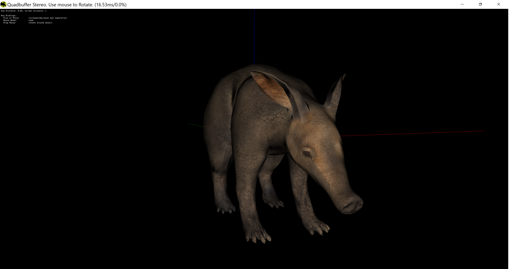

This example shows:
  * how to get a quadbuffer stereo window from aardvark
  * how to get aardvark to use a custom stereo projection (pair of projection trafos)

On hardware which supports Quadbuffer stereo, a nice aardvark model is rendered in 3D.
